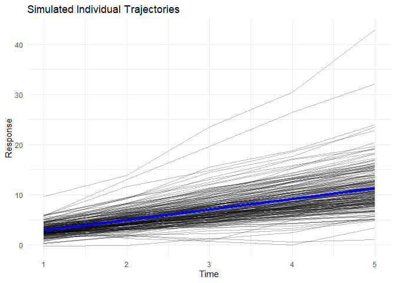
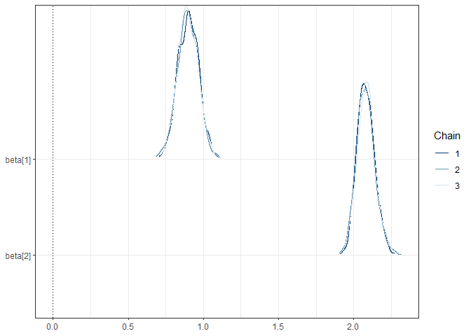
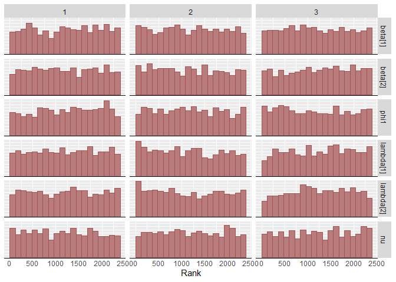
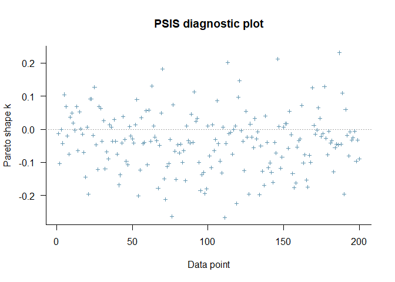
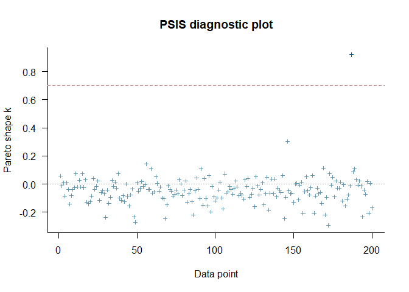
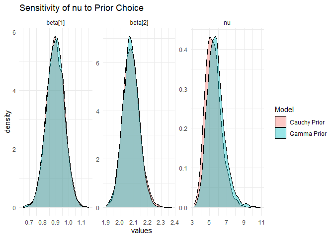

Supplementary Material: Bayesian estimation in scale mixture of
skew-normal linear mixed models using Hamiltonian Monte Carlo
================
Fernanda L Schumacher, Larissa A Matos, Pedro L Ramos, and Francisco
Louzada

- [Introduction](#introduction)
- [Loading packages and auxiliary
  functions](#loading-packages-and-auxiliary-functions)
- [Data Generation](#data-generation)
- [AR(1)-ST-LMM Fitting using Stan](#ar1-st-lmm-fitting-using-stan)
- [Model comparison](#model-comparison)
- [Sensitivity analysis: changing prior distribution for shape
  parameter](#sensitivity-analysis-changing-prior-distribution-for-shape-parameter)
- [Frequentist Comparison (EM
  Algorithm)](#frequentist-comparison-em-algorithm)

## Introduction

This document provides the full reproducible workflow for the simulation
and estimation of the AR(1) Skew-t Linear Mixed Model (AR1-ST-LMM)
discussed in the main text, in addition for comparisons with a Gaussian
model and a brief sensitivity analysis for the degrees of freedom
parameter $\nu$. All materials needed to reproduce this code are
available at <https://github.com/fernandalschumacher/HMC-SMSN-LMM>.

Stan is required for running this code. For information on installing
Stan, please check
<https://github.com/stan-dev/rstan/wiki/RStan-Getting-Started#installation-of-rstan>.

## Loading packages and auxiliary functions

``` r
library(tictoc)
library(dplyr)
library(tidyr)
library(purrr)
library(ggplot2)
library(loo)
library(rstan)
library(posterior)
library(bayesplot)
library(HDInterval)
library(skewlmm)
library(bayesplot)
library(mvtnorm)

source("auxfunctions-bayes.R")
```

## Data Generation

We generate a longitudinal dataset with $m=200$ subjects and $n_j=5$
observations per subject from an AR(1)-ST-LMM using the skewlmm package.

``` r
set.seed(955)
nj1 <- 5 
m <- 200 
D1_true <- matrix(c(.5,.1,.1,1), ncol=2) 

gendatList <- map(rep(nj1, m), function(nj) {
  skewlmm::rsmsn.lmm(1:nj, cbind(1, 1:nj), cbind(1, 1:nj), 
                     sigma2 = .25, D1 = D1_true, beta = c(1, 2), 
                     lambda = c(1,3), depStruct = "ARp", 
                     phi = .5, distr = 'st', nu = 6)
})

gendat <- bind_rows(gendatList, .id = "ind") %>%
  mutate(indnum = as.numeric(ind)) %>%
  arrange(indnum)

# Visualization
ggplot(gendat, aes(x = x, y = y, group = ind)) + 
  geom_line(alpha = 0.3) +
  stat_summary(aes(group = 1), geom = "line", fun = mean, col = "blue", size = 1.5) +
  theme_minimal() + 
  labs(title = "Simulated Individual Trajectories", x = "Time", y = "Response")
```

<!-- -->

## AR(1)-ST-LMM Fitting using Stan

### Setup Data for Stan

``` r
N <- nrow(gendat)
n <- n_distinct(gendat$ind)
x_mat <- model.matrix(y ~ x, data = gendat)
z_mat <- model.matrix(~ x, data = gendat)
l_cols <- ncol(x_mat)
q1_cols <- ncol(z_mat)
njvec <- as.numeric(table(gendat$indnum))

data_list_stan <- list(
  y = gendat$y, x = x_mat, z = z_mat, 
  timevar = gendat$time, indnum = gendat$indnum
)
```

### Fitting the ST Model

``` r
tic("AR(1)-ST-LMM Fit")
tbayes <- stan(file = 'lmm-AR1-ST.stan', 
               data = list(N=N, n=n, l=l_cols, q1=q1_cols, njvec=njvec, 
                           y=gendat$y, x=x_mat, z=z_mat, 
                           timevar=gendat$time, ind=gendat$indnum, sdLP=2), 
               thin = 5, chains = 3, iter = 5000, warmup = 1000, seed = 9955)
toc()
```

    ## AR(1)-ST-LMM Fit: 3781.87 sec elapsed

``` r
print(tbayes, pars=c("beta","sigmae","phi1","D1","lambda","nu"), probs=c(.025,.975), digits=3)
```

    ## Inference for Stan model: anon_model.
    ## 3 chains, each with iter=5000; warmup=1000; thin=5; 
    ## post-warmup draws per chain=800, total post-warmup draws=2400.
    ## 
    ##             mean se_mean    sd   2.5% 97.5% n_eff  Rhat
    ## beta[1]    0.898   0.001 0.068  0.765 1.033  2032 1.001
    ## beta[2]    2.081   0.001 0.060  1.973 2.207  2200 1.002
    ## sigmae     0.528   0.001 0.024  0.478 0.575   996 1.002
    ## phi1       0.581   0.003 0.071  0.415 0.696   583 1.007
    ## D1[1,1]    0.092   0.005 0.100  0.000 0.352   427 1.010
    ## D1[1,2]    0.029   0.002 0.078 -0.131 0.189  1791 1.000
    ## D1[2,1]    0.029   0.002 0.078 -0.131 0.189  1791 1.000
    ## D1[2,2]    0.826   0.005 0.159  0.544 1.139   926 1.003
    ## lambda[1] -0.068   0.063 0.963 -2.013 1.841   233 1.016
    ## lambda[2]  2.938   0.032 0.921  1.453 4.956   835 1.001
    ## nu         5.435   0.022 0.924  3.899 7.480  1744 1.000
    ## 
    ## Samples were drawn using NUTS(diag_e) at Fri Dec 26 23:56:33 2025.
    ## For each parameter, n_eff is a crude measure of effective sample size,
    ## and Rhat is the potential scale reduction factor on split chains (at 
    ## convergence, Rhat=1).

``` r
mcmc_dens_chains(tbayes, pars = c("beta[1]","beta[2]"))+
  geom_vline(xintercept = 0, linetype = "dotted") + theme_bw()
```

<!-- -->

### Checking Acceptance Probability

``` r
sampler_params <- get_sampler_params(tbayes, inc_warmup = FALSE)
mean(unlist(lapply(sampler_params, function(x) x[, "accept_stat__"])))
```

    ## [1] 0.9179794

### Computing Highest (Posterior) Density Intervals (HDI)

``` r
tsample <- rstan::extract(tbayes, pars = c("beta[1]","beta[2]","sigmae","phi1","D1[1,1]",
                                    "D1[1,2]","D1[2,2]","lambda[1]","lambda[2]","nu"))
HDI<- HDInterval::hdi(tsample) %>% unlist()
data.frame(lower = HDI[c(TRUE, FALSE)],upper = HDI[c(FALSE, TRUE)]) %>% knitr::kable()
```

|                   |      lower |     upper |
|:------------------|-----------:|----------:|
| beta\[1\].lower   |  0.7558937 | 1.0221253 |
| beta\[2\].lower   |  1.9744829 | 2.2081761 |
| sigmae.lower      |  0.4747794 | 0.5712310 |
| phi1.lower        |  0.4363855 | 0.7109411 |
| D1\[1,1\].lower   |  0.0000000 | 0.3038586 |
| D1\[1,2\].lower   | -0.1325639 | 0.1868039 |
| D1\[2,2\].lower   |  0.5440794 | 1.1395394 |
| lambda\[1\].lower | -2.0187785 | 1.8202168 |
| lambda\[2\].lower |  1.3409993 | 4.8007222 |
| nu.lower          |  3.7751090 | 7.2890852 |

### Exploring the Posterior Distributions

``` r
bayesplot::color_scheme_set("red")
bayesplot::mcmc_rank_hist(tbayes, pars=c("beta[1]","beta[2]","phi1","lambda[1]","lambda[2]","nu"))
```

<!-- -->

Additional exploration can be easily done by launching the shinny
application using `launch_shinystan(tbayes)`.

### Computing Information Criteria

To evaluate the marginal log-likelihood function, an approximation of
Leave-One-Out Cross-Validation (LOO), and the Widely applicable
information criterion (WAIC) for all MCMC samples, we can use the
function `criteriaAR1`:

``` r
# ST Model LOO
st_loo <- criteriaAR1(tbayes, data_list_stan, distr = "st")

# Checking the Pareto smoothed importance sampling (PSIS)
plot(st_loo$loo)
```

<!-- -->

## Model comparison

We first compare the ST model against a standard Normal model.

``` r
# Normal Model Fitting
tic("AR(1)-N-LMM Fit")
nbayes <- stan(file = 'lmm-AR1-N.stan', 
               data = list(N=N, n=n, l=l_cols, q1=q1_cols, njvec=njvec, 
                           y=gendat$y, x=x_mat, z=z_mat, 
                           timevar=gendat$time, ind=gendat$indnum), 
               thin = 5, chains = 3, iter = 5000, warmup = 1000, seed = 9955)
toc()
```

    ## AR(1)-N-LMM Fit: 3168.53 sec elapsed

``` r
# Computing the information criteria
normal_loo <- criteriaAR1(nbayes, data_list_stan, distr = "sn")

# Checking the Pareto smoothed importance sampling (PSIS)
plot(normal_loo$loo)
```

<!-- -->

### Comparing the models based on LOO

``` r
comp_loo <- loo_compare(list(ST = st_loo$loo, Normal = normal_loo$loo))
knitr::kable(comp_loo, caption = "Model Comparison: LOO Criteria", simplify = FALSE)
```

|  | elpd_diff | se_diff | elpd_loo | se_elpd_loo | p_loo | se_p_loo | looic | se_looic |
|:---|---:|---:|---:|---:|---:|---:|---:|---:|
| ST | 0.00000 | 0.00000 | -1370.738 | 30.48947 | 6.212676 | 0.7299541 | 2741.476 | 60.97893 |
| Normal | -82.49983 | 30.19118 | -1453.238 | 48.94037 | 8.824400 | 5.0013610 | 2906.476 | 97.88074 |

Model Comparison: LOO Criteria

### Comparing the models based on WAIC

``` r
comp_loo <- loo_compare(list(ST = st_loo$waic, Normal = normal_loo$waic))
knitr::kable(comp_loo, caption = "Model Comparison: WAIC Criteria", simplify = FALSE)
```

|  | elpd_diff | se_diff | elpd_waic | se_elpd_waic | p_waic | se_p_waic | waic | se_waic |
|:---|---:|---:|---:|---:|---:|---:|---:|---:|
| ST | 0.00000 | 0.00000 | -1370.727 | 30.48860 | 6.202024 | 0.7303406 | 2741.455 | 60.97721 |
| Normal | -82.48586 | 30.17448 | -1453.213 | 48.92392 | 8.799775 | 4.9826414 | 2906.426 | 97.84784 |

Model Comparison: WAIC Criteria

### Other skewed and heavy-tailed distribution

Other potential candidates to fit skewed and heavy-tailed data is to use
the Skew-Slash and the Skew-Contaminated Normal distributions.

We can estimate the skew-slash model using the following:

``` r
# Fitting SSL-AR(1) for comparison
tic()
slbayes <- stan(file='lmm-AR1-SSL.stan', 
                data = list(N=N, n=n, l=l_cols, q1=q1_cols, njvec=njvec, 
                           y=gendat$y, x=x_mat, z=z_mat, 
                           timevar=gendat$time, ind=gendat$indnum, sdLP=2), 
               thin = 5, chains = 3, iter = 5000, warmup = 1000, seed = 9955, 
               control = list(adapt_delta=.95))
toc()
```

    ## 6064.97 sec elapsed

``` r
print(slbayes,par=c("beta","sigmae","phi1","D1","lambda","nu"), 
      probs = c(.025,.975), digits=3)
```

    ## Inference for Stan model: anon_model.
    ## 3 chains, each with iter=5000; warmup=1000; thin=5; 
    ## post-warmup draws per chain=800, total post-warmup draws=2400.
    ## 
    ##            mean se_mean    sd   2.5% 97.5% n_eff  Rhat
    ## beta[1]   0.896   0.001 0.067  0.768 1.030  2140 1.001
    ## beta[2]   2.085   0.001 0.061  1.970 2.210  2147 1.000
    ## sigmae    0.431   0.001 0.025  0.380 0.477   825 1.001
    ## phi1      0.563   0.004 0.084  0.355 0.685   418 1.001
    ## D1[1,1]   0.076   0.004 0.078  0.000 0.271   441 1.001
    ## D1[1,2]   0.028   0.001 0.057 -0.082 0.149  1449 0.999
    ## D1[2,1]   0.028   0.001 0.057 -0.082 0.149  1449 0.999
    ## D1[2,2]   0.569   0.003 0.112  0.363 0.798  1375 1.001
    ## lambda[1] 0.065   0.044 0.907 -1.783 1.975   426 1.004
    ## lambda[2] 2.942   0.029 0.925  1.415 5.029  1029 1.000
    ## nu        1.662   0.005 0.226  1.268 2.137  1838 1.001
    ## 
    ## Samples were drawn using NUTS(diag_e) at Wed Mar 25 18:32:53 2026.
    ## For each parameter, n_eff is a crude measure of effective sample size,
    ## and Rhat is the potential scale reduction factor on split chains (at 
    ## convergence, Rhat=1).

``` r
# Computing comparison criteria 
ssl_loo <- criteriaAR1(slbayes, data_list_stan, distr = "ss")
```

Now, for the skew-contaminated normal, since Stan cannot directly sample
from discrete distributions, we will use an approximation by treating
the subject-level mixing variable, $u_i$, as a continuous parameter
drawn from a mixture of two narrow Gaussian distributions. To ensure
convergence and computational efficiency, the HMC chains were
initialized using fixed starting values. Specifically, the contamination
probability ($\nu_1$) and scale parameter ($\nu_2$) were initialized to
reflect a minority outlier class with inflated variance, while the
subject-level latent weights ($u_i$) were initialized near 1.0. This
targeted initialization prevents label switching, where the sampler
incorrectly swaps the ‘normal’ and ‘contaminated’ states.

``` r
# Setting initial values 
my_inits <- list(
  list(nu1 = 0.1, nu2 = 0.2, uvec = rep(1, n)),
  list(nu1 = 0.15, nu2 = 0.15, uvec = rep(0.9, n)),
  list(nu1 = 0.05, nu2 = 0.3, uvec = rep(1, n))
)

# Fitting aSCN-AR(1) for comparison
tic()
acnbayes <- stan(file='lmm-AR1-aSCN.stan', 
                data = list(N=N, n=n, l=l_cols, q1=q1_cols, njvec=njvec, 
                           y=gendat$y, x=x_mat, z=z_mat, 
                           timevar=gendat$time, ind=gendat$indnum, sdLP=2), 
                thin = 5, chains = 3, iter = 5000, warmup = 1000,
                init = my_inits,
                seed = 9955, control = list(adapt_delta=.98))
toc()
```

    ## 6968.04 sec elapsed

``` r
print(acnbayes,par=c("beta","sigmae","phi1","D1","lambda","nu1","nu2"), 
      probs = c(.025,.975), digits=3)
```

    ## Inference for Stan model: anon_model.
    ## 3 chains, each with iter=5000; warmup=1000; thin=5; 
    ## post-warmup draws per chain=800, total post-warmup draws=2400.
    ## 
    ##            mean se_mean    sd   2.5% 97.5% n_eff  Rhat
    ## beta[1]   0.893   0.001 0.066  0.766 1.023  2035 1.000
    ## beta[2]   2.046   0.001 0.056  1.939 2.158  2343 1.000
    ## sigmae    0.502   0.002 0.030  0.442 0.558   227 1.012
    ## phi1      0.559   0.004 0.081  0.373 0.685   446 1.000
    ## D1[1,1]   0.106   0.005 0.107  0.000 0.364   418 1.001
    ## D1[1,2]   0.038   0.002 0.081 -0.129 0.208  1240 1.001
    ## D1[2,1]   0.038   0.002 0.081 -0.129 0.208  1240 1.001
    ## D1[2,2]   0.784   0.006 0.148  0.518 1.094   679 1.004
    ## lambda[1] 0.058   0.057 0.870 -1.578 1.859   237 1.013
    ## lambda[2] 3.012   0.033 0.902  1.504 5.072   755 1.001
    ## nu1       0.264   0.007 0.087  0.124 0.450   173 1.020
    ## nu2       0.348   0.003 0.050  0.243 0.443   359 1.012
    ## 
    ## Samples were drawn using NUTS(diag_e) at Wed Mar 25 20:59:32 2026.
    ## For each parameter, n_eff is a crude measure of effective sample size,
    ## and Rhat is the potential scale reduction factor on split chains (at 
    ## convergence, Rhat=1).

``` r
# Computing comparison criteria 
ascn_loo <- criteriaAR1(acnbayes, data_list_stan, distr = "scn")
```

We can now compare the criteria for all 4 models:

``` r
comp_loo <- loo_compare(list(norm = normal_loo$loo,
                             st = st_loo$loo,
                             scn = ascn_loo$loo,
                             ssl = ssl_loo$loo))
knitr::kable(comp_loo, caption = "Model Comparison: LOO Criteria", simplify = FALSE)
```

|  | elpd_diff | se_diff | elpd_loo | se_elpd_loo | p_loo | se_p_loo | looic | se_looic |
|:---|---:|---:|---:|---:|---:|---:|---:|---:|
| st | 0.00000 | 0.000000 | -1370.738 | 30.48947 | 6.212676 | 0.7299541 | 2741.476 | 60.97893 |
| scn | -26.26331 | 13.311856 | -1397.001 | 37.09305 | 14.925365 | 8.5440490 | 2794.003 | 74.18610 |
| ssl | -34.77830 | 3.907916 | -1405.516 | 28.15291 | 5.508071 | 0.6924085 | 2811.033 | 56.30581 |
| norm | -82.49983 | 30.191177 | -1453.238 | 48.94037 | 8.824400 | 5.0013610 | 2906.476 | 97.88074 |

Model Comparison: LOO Criteria

``` r
#
comp_waic <- loo_compare(list(norm = normal_loo$waic,
                              st = st_loo$waic, 
                              scn = ascn_loo$waic,
                              ssl = ssl_loo$waic))
knitr::kable(comp_waic, caption = "Model Comparison: WAIC Criteria", simplify = FALSE)
```

|  | elpd_diff | se_diff | elpd_waic | se_elpd_waic | p_waic | se_p_waic | waic | se_waic |
|:---|---:|---:|---:|---:|---:|---:|---:|---:|
| st | 0.00000 | 0.000000 | -1370.727 | 30.48860 | 6.202024 | 0.7303406 | 2741.455 | 60.97721 |
| scn | -26.79049 | 13.864238 | -1397.518 | 37.48060 | 15.441886 | 9.1062780 | 2795.036 | 74.96119 |
| ssl | -34.78068 | 3.908358 | -1405.508 | 28.15277 | 5.499799 | 0.6959429 | 2811.016 | 56.30553 |
| norm | -82.48586 | 30.174481 | -1453.213 | 48.92392 | 8.799775 | 4.9826414 | 2906.426 | 97.84784 |

Model Comparison: WAIC Criteria

## Sensitivity analysis: changing prior distribution for shape parameter

To evaluate the model’s sensitivity to the choice of the prior
distribution for $\nu$, we now compare our original results based on a
truncated Cauchy distribution with the ones considering a Gamma(2, 0.2)
prior distribution for $\nu$.

``` r
tic("AR(1)-ST-LMM Fit with Gamma prior")
tbayes_nu <- stan(file='lmm-AR1-ST-nuprior.stan', 
                  data = list(N=N, n=n, l=l_cols, q1=q1_cols, njvec=njvec, 
                           y=gendat$y, x=x_mat, z=z_mat, 
                           timevar=gendat$time, ind=gendat$indnum, sdLP=2), 
               thin = 5, chains = 3, iter = 5000, warmup = 1000, seed = 9955,
               control = list(adapt_delta=.95))
toc()
```

    ## AR(1)-ST-LMM Fit with Gamma prior: 5193.34 sec elapsed

``` r
print(tbayes_nu,par=c("beta","sigmae","phi1","D1","lambda","nu"), 
      probs = c(.025,.975), digits=3)
```

    ## Inference for Stan model: anon_model.
    ## 3 chains, each with iter=5000; warmup=1000; thin=5; 
    ## post-warmup draws per chain=800, total post-warmup draws=2400.
    ## 
    ##             mean se_mean    sd   2.5% 97.5% n_eff  Rhat
    ## beta[1]    0.897   0.001 0.068  0.764 1.026  2390 1.001
    ## beta[2]    2.079   0.001 0.058  1.966 2.196  2318 1.000
    ## sigmae     0.528   0.001 0.026  0.475 0.575   807 1.002
    ## phi1       0.570   0.004 0.080  0.372 0.690   482 1.004
    ## D1[1,1]    0.112   0.005 0.116  0.000 0.413   489 1.001
    ## D1[1,2]    0.031   0.002 0.082 -0.142 0.194  1542 1.000
    ## D1[2,1]    0.031   0.002 0.082 -0.142 0.194  1542 1.000
    ## D1[2,2]    0.851   0.004 0.162  0.569 1.206  1344 1.001
    ## lambda[1] -0.044   0.041 0.884 -1.834 1.764   457 1.003
    ## lambda[2]  2.941   0.030 0.925  1.499 5.057   982 1.006
    ## nu         5.732   0.023 0.991  4.110 7.993  1842 1.002
    ## 
    ## Samples were drawn using NUTS(diag_e) at Sat Dec 27 02:37:27 2025.
    ## For each parameter, n_eff is a crude measure of effective sample size,
    ## and Rhat is the potential scale reduction factor on split chains (at 
    ## convergence, Rhat=1).

``` r
## Comparing with original model
posterior1 <- posterior::as_draws_matrix(tbayes)       
posterior2 <- posterior::as_draws_matrix(tbayes_nu)    

library(posterior)
d1 <- as_draws_df(posterior1) |>
  dplyr::select(nu, starts_with("beta")) |>
  tidyr::pivot_longer(cols = everything(), names_to = "param",values_to="values") |>
  dplyr::mutate(Model = "Cauchy Prior")
d2 <- as_draws_df(posterior2) |>
  dplyr::select(nu, starts_with("beta")) |>
  pivot_longer(cols = everything(), names_to = "param",values_to="values") |>
  dplyr::mutate(Model = "Gamma Prior")

d <- dplyr::bind_rows(d1, d2)

ggplot(d, aes(x = values, fill = Model)) +
  geom_density(alpha = 0.4) +
  ggtitle("Sensitivity of nu to Prior Choice") +
  theme_minimal() + facet_wrap(~param, scale = "free")
```

<!-- -->

## Frequentist Comparison (EM Algorithm)

For validation, we compare our Bayesian estimates with the frequentist
EM algorithm results.

``` r
tic("Frequentist Model")
fit_EM <- smsn.lmm(data = gendat, formFixed = y~x, groupVar = 'ind', 
                   formRandom = ~x, depStruct = "ARp", timeVar = 'time',
                   distr = 'st')
toc()
```

    ## Frequentist Model: 190.59 sec elapsed

``` r
summary(fit_EM)
```

    ## Linear mixed models with distribution st and dependency structure ARp 
    ## Call:
    ## smsn.lmm(data = gendat, formFixed = y ~ x, groupVar = "ind", 
    ##     formRandom = ~x, depStruct = "ARp", timeVar = "time", distr = "st")
    ## 
    ## Distribution st with nu = 5.494048 
    ## 
    ## Random effects: 
    ##   Formula: ~x
    ##   Structure:  
    ##   Estimated variance (D):
    ##             (Intercept)          x
    ## (Intercept)  0.13344526 0.04799053
    ## x            0.04799053 0.85415275
    ## 
    ## Fixed effects: y ~ x
    ## with approximate confidence intervals
    ##                 Value Std.error CI 95% lower CI 95% upper
    ## (Intercept) 0.8998495 0.0712506    0.7602009     1.039498
    ## x           2.0808533 0.0588821    1.9654465     2.196260
    ## 
    ## Dependency structure: ARp
    ##   Estimate(s):
    ##    sigma2      phi1 
    ## 0.2702294 0.5484190 
    ## 
    ## Skewness parameter estimate: 0.05175053 2.698154
    ## 
    ## Model selection criteria:
    ##     logLik      AIC      BIC
    ##  -1324.429 2668.858 2717.936
    ## 
    ## Number of observations: 1000 
    ## Number of groups: 200
